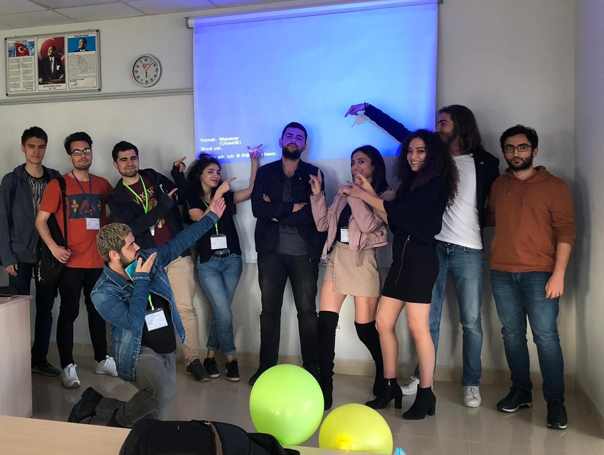
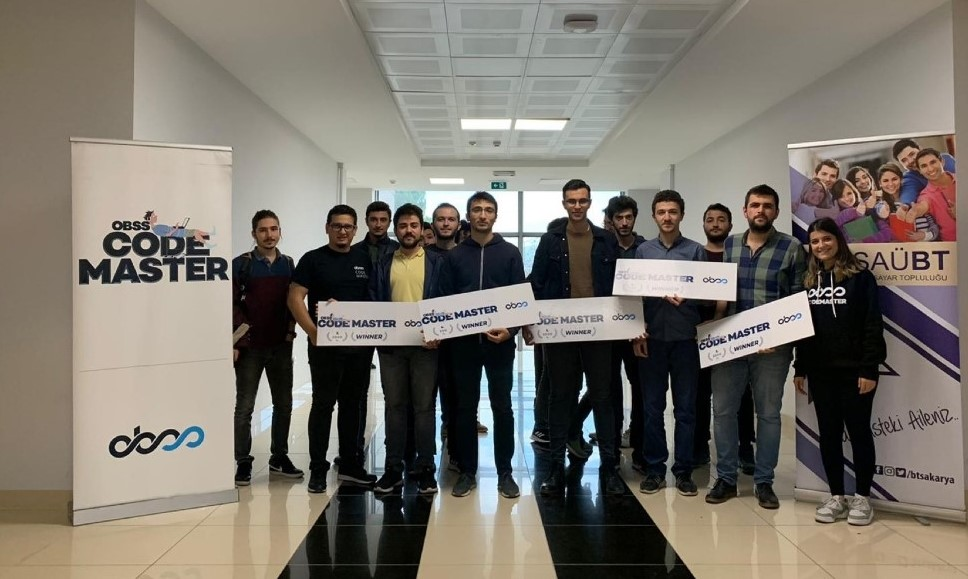
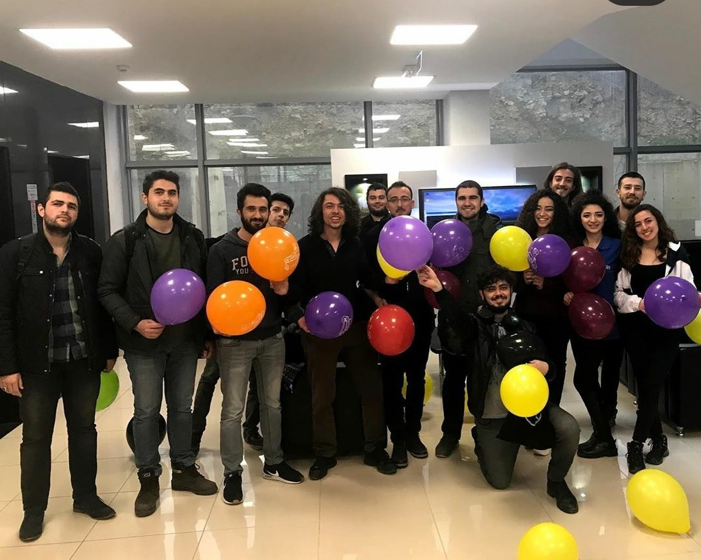

<!DOCTYPE html>
<html class="no-js" lang="en">

<head>
    <meta charset="utf-8">
    <meta http-equiv="X-UA-Compatible" content="IE=edge">
    <meta name="viewport" content="width=device-width, initial-scale=1">
    <title>Hakan Eryücel</title>
    <link rel="shortcut icon" href="favicon.ico" type="image/x-icon">
    <link rel="icon" href="favicon.ico" type="image/x-icon">
    <link href="https://fonts.googleapis.com/css?family=Lato:300,400,700,900" rel="stylesheet">
    <link rel="stylesheet" href="libs/font-awesome/css/font-awesome.min.css">
    <link href="css/bootstrap.min.css" rel="stylesheet">
    <link href="css/styles.css" rel="stylesheet">
</head>

<body>

    <i class="fa fa-bars" aria-hidden="true"></i>

<!-- End #mobile-menu-toggle -->
<header>
    

        Close <i class="fa fa-times" aria-hidden="true"></i>
    

    <ul id="menu" class="shadow">
        <li>
            <a href="#about">About</a>
        </li>
        <li>
            <a href="#experience">Experience</a>
        </li>
        <li>
            <a href="#education">Education</a>
        </li>
        <li>
            <a href="#projects">Projects</a>
        </li>
        <li>
            <a href="#events">Events</a>
        </li>
        <li>
            <a href="#skills">Skills</a>
        </li>
        <li>
            <a href="#contact">Contact</a>
        </li>
    </ul>
</header>
<!-- End header -->

    

        
        <h1>Hakan Eryucel</h1>
        <h2>Software & Computer Engineer</h2>
        

            <ul>
                <li>
                    <a href="https://github.com/Hakan-er/" target="_blank"><i class="fa fa-github fa-2x"
                                                                              style="color: white!important;"
                                                                              aria-hidden="true"></i></a>
                </li>
                <li>
                    <a href="https://www.linkedin.com/in/hak-er" target="_blank"><i class="fa fa-linkedin fa-2x"
                                                                                    style="color: white!important;"
                                                                                    aria-hidden="true"></i></a>
                </li>
                <li>
                    <a href="https://twitter.com/hakanerycl" target="_blank"><i class="fa fa-twitter fa-2x"
                                                                                style="color: white!important;"
                                                                                aria-hidden="true"></i></a>
                </li>
                <li>
                    <a href="https://www.instagram.com/hakanerycl/" target="_blank"><i class="fa fa-instagram fa-2x"
                                                                                       style="color: white!important;"
                                                                                       aria-hidden="true"></i></a>
                </li>
                <li>
                    <a href="https://steamcommunity.com/id/holysist" target="_blank"><i class="fa fa-steam fa-2x"
                                                                                        style="color: white!important;"
                                                                                        aria-hidden="true"></i></a>
                </li>
                <li>
                    <a href="mailto:hakanerycl@gmail.com" target="_blank"><i class="fa fa-envelope fa-2x"
                                                                             style="color: white!important;"
                                                                             aria-hidden="true"></i></a>
                </li>
            </ul>
        

        <!--            <a href="#" class="btn-rounded-white">Download My Resume</a>-->
    

    
Nallihan, Turkey  taken by me

    <!-- End #lead-content -->

    <!--    

-->

    

            
                <i class="fa fa-chevron-down" aria-hidden="true"></i>
            
    

    <!-- End #lead-down -->

<!-- End #lead -->

    

        

            

                <h2 class="heading">About Me</h2>
            

            

                

                    My name is Hakan Eryücel. This year, I graduated from the computer engineering(science) department with a GPA of 3.54, as the third in the department.
                    I
                    currently live in Turkey. I have been working as a web developer for a software company for two
                    years. I am also dealing with competitive programming and working on a machine learning platform as
                    a finishing work. Nowadays I try to learn to play harmonica in my spare time.
                

            

        

    

<!-- End #about -->

    <h2 class="heading">Experience</h2>
    

        

            <h3>Full-stack Developer</h3>
            <h4 style="font-family: 'Helvetica Neue',Helvetica,Arial,sans-serif">Erkay Teknoloji Geliştirme Hizmetleri
                San. Tic. Ltd. Şti.</h4>
            

                I worked on the development of a <b>crowdfunding</b> site with <b>Angular</b> and I designed the site's
                database. I
                also developed a <b>Kanban-based</b> project management site with <b>Angular</b> and <b>Slim Rest
                API</b> framework.
            

            <ul>
                <li>
                    Development of <b>RESTful APIs</b> with both <b>Django rest framework</b> and <b>PHP Slim
                    framework</b>
                </li>
                <li>
                    Backend development with <b>Php</b> and <b>Python</b>
                </li>
                <li>
                    Frontend development with <b>Angular</b>
                </li>
                <li>
                    <b>PostgreSQL</b> and <b>MySQL</b>
                </li>
            </ul>
        

        

            <h3>Web Developer Intern</h3>
            <h4 style="font-family: 'Helvetica Neue',Helvetica,Arial,sans-serif">Erkay Teknoloji Geliştirme Hizmetleri
                San. Tic. Ltd. Şti.</h4>
            

                I worked here as a part-time intern. I took part in the development of the <b>HR management</b> module,
                which
                is
                a part of the <b>ERP</b> software.
            

            <ul>
                <li>
                    Backend development with <b>PHP</b>
                </li>
                <li>
                    <b>MySQL</b> database development (mostly working with stored procedures)
                </li>
                <li>
                    Frontend development with <b>Javascript&Jquery</b>
                </li>
                <li>
                    <b>Bootstrap-based</b> interface development
                </li>
            </ul>
        

    

<!-- End #experience -->

    <h2 class="heading">Education</h2>
    

        <h3>Sakarya University - TURKEY</h3>
        Sept 2017 - July 2021
        <h4>Bachelor of Science in Computer Science (Engineering)</h4>
        <h4><b>CGPA:</b> <u>3.54/4</u> and <b>third degree in departmant</b></h4>
        

            I graduated from Sakarya University Computer Engineering Department in 2021 with the third place in the division. The computer engineering department of this university includes both general engineering courses, software courses and hardware courses.
        

    

    <!-- End .education-block -->

    

        <h3>Bolu Science High School - TURKEY</h3>
        2013 - 2017
        <h4></h4>
        <!--        <h4>Bachelor of Science in Computer Science</h4>-->
        

            I graduated from Bolu Science High School in Turkey. It is a high school with an emphasis on mathematics and
            science.
        

    

    <!-- End .education-block -->

<!-- End #education -->

    <h2 class="heading">Projects</h2>
    

        

            

                

                    <h3>UTMA - Online Machine Learning Platform</h3>
                    

                        We started this project with my friends as a final project. We are currently developing. We are
                        developing a
                        site that allows <b>machine learning online</b> without dealing with details and writing code.
                        We use
                        <b>Angular</b> in
                        the interface, <b>DJANGO Rest Framework</b> in the <b>API</b> part and <b>Python</b> in the <b>machine
                        learning</b> part.
                        When
                        we finish we will share it as an open source project.
                    

                    <a href="https://github.com/Hakan-er/utma">View Project on Github</a>
                

            

            

                

                    <h3>Participation Analysis - <b>PHP, pure JS</b></h3>
                    

                        A participation rate analysis system developed for universities within the scope of the <b>Internet
                        of Things</b>.
                        Collecting Participation data with the help of <b>NodeMcu device</b>, control, analysis by
                        lecture, analysis
                        by the lecturer,
                        or analysis by lecture time.
                    

                    <a href="https://github.com/Hakan-er/Participation-Analysis">View Project on Github</a>
                

            

        

        

            

                

                    <h3>News/Magazine Website - <b>asp.net</b></h3>
                    

                        A simple news site built with <b>MVC</b> structure using <b>asp.net</b>. <b>CRUD</b>
                        transactions can be done with
                        the admin panel. It has features such as multi-language, login, commenting, favorite news and
                        bookmarking.
                    

                    <a href="https://github.com/Hakan-er/news-site">View Project on Github</a>
                

            

            

                

                    <h3>Paint Program - <b>C#</b></h3>
                    

                        A drawing program developed in <b>C#</b>. It allows to draw four different shapes in the desired
                        size
                        by using
                        different colors. You can change the color or delete them by selecting the drawn shapes.
                        Provides the ability
                        to save work or continue an existing drawing.
                    

                    <a href="https://github.com/Hakan-er/paint-program">View Project on Github</a>
                

            

        

        

            

                

                    <h3>Hotel Management - <b>C++</b></h3>
                    

                        A CLI-based Hotel Management program. CRUD operations for rooms, customers, and reservations.
                    

                    <a href="https://github.com/Hakan-er/Hotel-Management">View Project on Github</a>
                

            

            

                

                    <h3>Just-C</h3>
                    

                        A Code <b>obfuscator</b> for the <b>C/C++</b>. It converts the entire code into a pyramid-shaped
                        code
                        consisting only of
                        the character 'c'.
                    

                    <a href="https://github.com/Hakan-er/just-c">View Project on Github</a>
                

            

        

        

            

                

                    <h3>Shell - <b>C</b></h3>
                    

                        A <b>Linux</b> command-line interpreter with features such as input&output redirection, piping,
                        background
                        tasks, and multiple tasks and processes.
                    

                    <a href="https://github.com/Hakan-er/Shell">View Project on Github</a>
                

            

            <!--            
-->
            <!--                
-->
            <!--                    <h3>One More Project - RUST</h3>-->
            <!--                    
-->
            <!--                        A Rust Project.-->
            <!--                        A Rust Project.-->
            <!--                        A Rust Project.-->
            <!--                        A Rust Project.-->
            <!--                        A Rust Project.-->
            <!--                        A Rust Project.-->
            <!--                    
-->
            <!--                    <a href="#">View Project on Github</a>-->
            <!--                
-->
            <!--            
-->
        

    

<!-- End #projects -->

    <h2 class="heading">Events</h2>
    

        

            

                

                    
                

                <!-- End .project-image -->
                

                    <h3>BilKamp Competitive Programming Contest</h3>
                    

                        [ 27/04/2019 ] 
                        <b>winner</b>
                    

                    <!--                    <a href="#">View Project</a>-->
                

                <!-- End .project-info -->
            

            <!-- End .project -->
            

                

                    
                

                <!-- End .project-image -->
                

                    <h3>OBSS Code Master Contest SAKARYA</h3>
                    

                        [ 28/11/2019 ] 
                        <b>third</b>
                    

                    <!--                    <a href="#">View Project</a>-->
                

                <!-- End .project-info -->
            

            <!-- End .project -->
            

                

                    
                

                <!-- End .project-image -->
                

                    <h3>IEEE Competitive Programming Contest </h3>
                    

                        [ 02/03/2019 ] 
                        <b>winner</b>
                    

                    <!--                    <a href="#">View Project</a>-->
                

                <!-- End .project-info -->
            

            <!-- End .project -->
        

    

    <h2 class="heading">Skills</h2>
    <ul>
        <li>Php</li>
        <li>Angular</li>
        <li>Django Rest Framework</li>
        <li>JavaScript</li>
        <li>MySQL</li>
        <li>PostgreSQL</li>
        <li>Jquery</li>
        <li>Python</li>
        <li>HTML</li>
        <li>Bootstrap</li>
        <li>Sass</li>
        <li>Tailwind</li>
        <li>CSS</li>
        <li>Php Slim Framework</li>
    </ul>

<!-- End #skills -->

    <h2>Get in Touch</h2>
    

        <form method="POST" action="https://formspree.io/f/xoqyqklk">
            <input type="hidden" name="_subject" value="Contact message from hakan-er.github.io"/>
            <input type="email" name="_replyto" placeholder="Your email" required>
            <textarea name="message" placeholder="Your message" required></textarea>
            <button type="submit">Send</button>
        </form>
    

    <!-- End #contact-form -->

<!-- End #contact -->

<footer>
    

        

            

                

                    Copyright &copy; 2021 HAKAN ERYÜCEL
                

            

            

                    
                        <i class="fa fa-chevron-up" aria-hidden="true"></i>
                    
            

            

                <ul>
                    <li>
                        <a href="https://github.com/Hakan-er/" target="_blank"><i class="fa fa-github"
                                                                                  aria-hidden="true"></i></a>
                    </li>
                    <li>
                        <a href="https://www.linkedin.com/in/hak-er" target="_blank"><i class="fa fa-linkedin"
                                                                                        aria-hidden="true"></i></a>
                    </li>
                    <li>
                        <a href="https://twitter.com/hakanerycl" target="_blank"><i class="fa fa-twitter"
                                                                                    aria-hidden="true"></i></a>
                    </li>
                    <li>
                        <a href="https://www.instagram.com/hakanerycl/" target="_blank"><i class="fa fa-instagram"
                                                                                           aria-hidden="true"></i></a>
                    </li>
                    <li>
                        <a href="https://steamcommunity.com/id/holysist" target="_blank"><i class="fa fa-steam"
                                                                                            aria-hidden="true"></i></a>
                    </li>
                </ul>
            

        

    

</footer>
<!-- End footer -->

</body>

</html>
